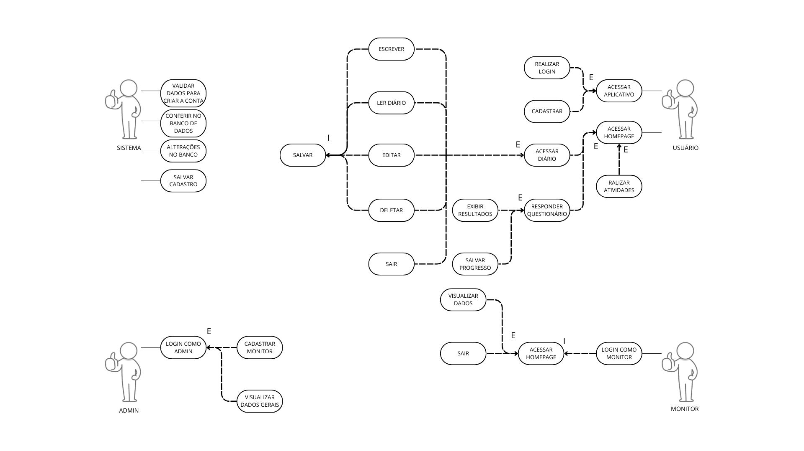

# Hackaton - 2024 - Happiology

# Estrutura do Repositório
Este repositório contém diversos artefatos importantes para a documentação e modelagem do software, incluindo diagramas e modelos de negócio. Abaixo está a descrição de cada um dos itens presentes.

# 1. Business Model Canvas
O Business Model Canvas é uma representação visual do modelo de negócios utilizado para o desenvolvimento deste software. Ele permite visualizar de maneira clara os principais componentes do negócio, como propostas de valor, segmentos de clientes, canais, parcerias, fluxos de receita, entre outros.
 

# 2. Diagrama de Caso de Uso (UML)
O Diagrama de Caso de Uso utiliza a notação UML para descrever as principais interações dos usuários com o sistema. Este diagrama foca nos casos de uso, representando as funcionalidades esperadas do sistema e quem interage com elas.
 

# 3. Diagrama BPMN (Business Process Model and Notation)
O Diagrama BPMN descreve os processos de negócio relacionados ao software de forma gráfica. Ele detalha o fluxo dos processos de negócio, mostrando como as atividades são realizadas e as interações entre os diversos atores envolvidos.

<a href="artefatos/BPMN.bpm" target="#"> artefatos/BPMN.bpm </a>

# 4. Matriz de Rastreabilidade
A Matriz de Rastreabilidade relaciona os requisitos do sistema às regras de negócio. Esse artefato é essencial para garantir que todos os requisitos estejam sendo cumpridos e rastrear a implementação das funcionalidades.

| **ID do Requisito** | **Descrição do Requisito** | **Funcionalidade Relacionada** | **Teste de Validação** | **Componente do Sistema** |
| --- | --- | --- | --- | --- |
| **RF01** | Cadastro de Usuário | Permitir o cadastro de novos usuários | Testar criação de conta com dados válidos e inválidos | Sistema de Cadastro |
| **RF02** | Login de Usuário | Permitir o login dos usuários | Verificar login com credenciais válidas e inválidas | Sistema de Autenticação |
| **RF03** | Acesso ao Diário | Permitir o acesso ao diário pessoal | Validar o acesso ao diário após login bem-sucedido | Sistema de Diário |
| **RF04** | Edição de Entrada no Diário | Permitir edição de entradas no diário | Testar se o usuário consegue editar entradas no diário sem perda de dados | Sistema de Diário |
| **RF05** | Deletar Entrada do Diário | Permitir exclusão de entradas do diário | Verificar exclusão de entradas com confirmação de ação | Sistema de Diário |
| **RF06** | Responder Questionário | Permitir resposta aos questionários | Validar diferentes respostas e registros de respostas para questionários | Sistema de Questionários |
| **RF07** | Exibição de Resultados | Exibir resultados dos questionários | Testar exibição correta dos resultados com base nas respostas dos questionários | Sistema de Relatórios |
| **RF08** | Vinculação de Usuário com Monitor | Permitir vinculação com monitor | Verificar se o monitor consegue visualizar dados dos usuários vinculados | Sistema de Vinculação |
| **RF09** | Cadastro de Monitor/Admin | Permitir cadastro de monitores/admins | Testar criação de contas de monitor/admin com permissões especiais | Sistema de Cadastro/Admin |
| **RF010** | Visualizar Dados Gerais (Admin) | Permitir visualização de dados gerais | Verificar se monitores e admins conseguem visualizar dados gerais de usuários | Sistema de Administração |
| **RNF01** | Segurança | Garantir proteção de dados | Testar se os dados do usuário estão sendo armazenados e transmitidos de forma segura | Sistema de Segurança |
| **RNF03** | Escalabilidade | Suportar crescimento de usuários | Testar o sistema com uma carga alta de usuários simultâneos | Sistema de Infraestrutura |
| **RNF05** | Usabilidade | Garantir fácil uso e navegação | Testar a interface de usuário com diferentes perfis de usuários | Interface de Usuário |
| **RNF06** | Conformidade com LGPD | Estar em conformidade com a LGPD | Verificar o consentimento e a política de privacidade dos dados | Sistema de Segurança/Compliance |
| **RNF07** | Compatibilidade Multi-Dispositivo | Suportar múltiplos dispositivos | Testar o sistema em diferentes dispositivos e navegadores | Sistema de Interface |

# 5. DER (Diagrama Entidade-Relacionamento) / MER (Modelo Entidade-Relacionamento)
O Diagrama Entidade-Relacionamento (DER) mostra a estrutura do banco de dados, detalhando as entidades e as relações entre elas. Esse diagrama é essencial para entender a modelagem dos dados e como as informações estão conectadas no sistema. O MER (Modelo Entidade-Relacionamento) é uma técnica de modelagem de dados que descreve de forma abstrata como as informações estão estruturadas em um sistema.
 
  

